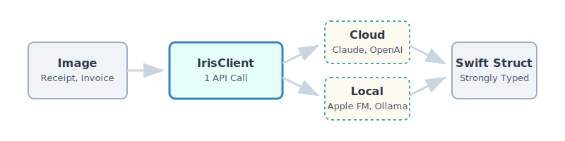

# Iris

> Parse document images into typed Swift models with one clean API.

[](https://swift.org)
[](#requirements)
[](LICENSE)

Iris is a Swift library for turning receipts, invoices, forms, and other document images into typed Swift values.

It handles image normalization, schema-aware prompting, provider integration, and JSON decoding so your app can go from image input to a strongly typed result with a single call.

<p align="center">
  
</p>

Supported providers:

- Claude
- OpenAI
- Gemini
- Ollama
- Apple Foundation Models

## At a Glance

| What you get | Why it matters |
| --- | --- |
| Typed parsing | Work with Swift models instead of loose JSON |
| One provider API | Swap providers without changing your app flow |
| Image input support | Parse from `URL`, `Data`, `UIImage`, or `NSImage` |
| Better reliability | Normalize common model-output quirks before decoding |
| Testability | Use `.mock` or a custom provider in unit tests |

## Why Iris

- One parsing API across cloud and on-device providers
- Typed extraction into Swift models instead of manual JSON dictionaries
- Built-in image preprocessing for `URL`, `Data`, `UIImage`, and `NSImage`
- Provider switching in one line without changing your parsing call sites
- `@Parseable` for stronger schema generation and more reliable typed output
- Test-friendly architecture with mock and custom providers

## Quick Start

This is the core experience Iris is designed for:

```swift
let receipt = try await iris.parse(fileURL: receiptImageURL, as: Receipt.self)
```

Input image in, typed Swift model out.

```swift
import Iris

@Parseable
struct Receipt {
    let storeName: String?
    let totalAmount: Double?
    let items: [String]?
}

let iris = IrisClient(apiKey: "sk-ant-...")
let receipt = try await iris.parse(fileURL: receiptImageURL, as: Receipt.self)

print(receipt.storeName ?? "Unknown store")
print(receipt.totalAmount ?? 0)
```

For the most robust typed extraction, prefer `@Parseable` on models that include `Int`, `Double`, or `Bool` fields.

Why this feels good in practice:

- your app code stays small
- your parsing result is already typed
- you can switch providers later without rewriting call sites

Platform-specific overloads are also available:

```swift
// iOS
let receipt = try await iris.parse(image: uiImage, as: Receipt.self)

// macOS
let receipt = try await iris.parse(image: nsImage, as: Receipt.self)
```

## Installation

Add Iris with Swift Package Manager:

```swift
dependencies: [
    .package(url: "https://github.com/matheusbispo/Iris.git", from: "1.0.0"),
],
targets: [
    .target(
        name: "YourApp",
        dependencies: ["Iris"]
    )
]
```

Then import it where needed:

```swift
import Iris
```

## How It Works

Iris stays small at the call site because it handles the repetitive plumbing for you.

1. Iris normalizes the input image into a supported JPEG payload
2. It builds a schema-aware extraction prompt from your target model
3. The selected provider returns JSON-like output
4. Iris normalizes safe formatting mismatches and decodes into your Swift type

That means you keep one typed API while changing providers based on cost, privacy, speed, or availability.

## Providers

The parsing API stays the same. Only the provider changes.

Switch providers without changing the parsing call itself:

```swift
// Claude (default)
let iris = IrisClient(apiKey: "sk-ant-...")

// OpenAI
let iris = IrisClient(provider: .openAI(apiKey: "sk-..."))

// Gemini
let iris = IrisClient(provider: .gemini(apiKey: "AIza..."))

// Ollama
let iris = IrisClient(provider: .ollama(model: "llama3.2-vision"))

// Apple Foundation Models
let iris = IrisClient(provider: .appleFoundationModels())

// Mock provider for tests
let iris = IrisClient(provider: .mock)

// Custom provider
let custom = IrisProvider { imageData, prompt in
    _ = imageData
    _ = prompt
    return #"{"storeName":"Custom Store","totalAmount":42.0}"#
}
let iris = IrisClient(provider: custom)
```

Example provider swap:

```swift
// Before
let iris = IrisClient(apiKey: "sk-ant-...")

// After
let iris = IrisClient(provider: .gemini(apiKey: "AIza..."))

// Parsing call stays the same
let receipt = try await iris.parse(fileURL: receiptImageURL, as: Receipt.self)
```

## Choosing a Provider

| Provider | Min Platform | API Key | Privacy | Best For |
| --- | --- | --- | --- | --- |
| `IrisClient(apiKey:)` / Claude | iOS 16+, macOS 13+ | Required | Remote | Best accuracy on harder documents |
| `.openAI(apiKey:)` | iOS 16+, macOS 13+ | Required | Remote | Strong general-purpose extraction |
| `.gemini(apiKey:)` | iOS 16+, macOS 13+ | Required | Remote | Good speed and accessible pricing |
| `.ollama(model:)` | iOS 16+, macOS 13+ | None | Local | Private/local inference with your own model |
| `.appleFoundationModels()` | iOS 26+, macOS 26+ | None | On-device | Native Apple stack and strict privacy needs |

Recommended defaults:

- Start with Claude for the strongest accuracy on complex documents
- Use Gemini or OpenAI when you want cloud-based alternatives
- Use Ollama when you control the local model/runtime
- Use Apple Foundation Models when your app targets the latest Apple platforms and on-device processing matters most

If you want the safest default recommendation for a production app, start with Claude and `@Parseable` models.

## API Keys

Each cloud provider uses its own key. Ollama and Apple Foundation Models do not require one.

```swift
// Claude from environment
let iris = IrisClient()

// Claude explicit
let iris = IrisClient(apiKey: "sk-ant-...")

// OpenAI
let iris = IrisClient(provider: .openAI(apiKey: "sk-..."))

// Gemini
let iris = IrisClient(provider: .gemini(apiKey: "AIza..."))

// No key needed
let iris = IrisClient(provider: .ollama(model: "llama3.2-vision"))
```

`IrisClient()` reads `ANTHROPIC_API_KEY` by default.

Production guidance:

- Best option: send requests through a server-side proxy and keep the key off the client
- Practical alternative: obfuscate embedded keys with [SwiftSecretKeys](https://github.com/MatheusMBispo/SwiftSecretKeys)

## Common Use Cases

Iris works especially well for:

- receipts and expense capture
- invoices and billing flows
- simple forms and structured business documents
- internal tools that need fast document extraction
- privacy-sensitive apps that may prefer Ollama or Apple Foundation Models

If your app needs structured extraction from images but you do not want provider-specific code spread across the project, Iris is a good fit.

## Testing

Testing stays straightforward because the provider layer is injectable.

Use `IrisProvider.mock` when you want to exercise your app logic without making network calls.

```swift
import Iris
import Testing

@Parseable
struct Receipt {
    let storeName: String?
    let totalAmount: Double?
    let items: [String]?
}

@Test
func parseReceiptWithoutAPIKey() async throws {
    let iris = IrisClient(provider: .mock)
    let url = URL(fileURLWithPath: "Tests/IrisTests/Fixtures/supermarket-receipt.jpg")

    let receipt = try await iris.parse(fileURL: url, as: Receipt.self)

    #expect(receipt.storeName == nil)
    #expect(receipt.totalAmount == nil)
    #expect(receipt.items == nil)
}
```

Apple Foundation Models smoke tests are opt-in:

```bash
IRIS_RUN_APPLE_FM_SMOKE=1 swift test --filter integration_parseSupermarketReceiptWithAppleFoundationModels
IRIS_RUN_APPLE_FM_SMOKE=1 swift test --filter integration_parseInvoiceWithAppleFoundationModels
```

Those tests only run when `SystemLanguageModel.default.isAvailable` is `true` on `iOS 26+` or `macOS 26+`.

## Robustness Notes

Iris includes provider output normalization before decoding.

It can safely recover from common model output issues such as:

- JSON wrapped in prose or markdown fences
- numeric fields returned as quoted currency strings
- comma-based decimal formatting when unambiguous
- boolean strings like `"true"`, `"false"`, `"yes"`, or `"no"`
- `"null"` returned for nullable fields

Ambiguous numeric formats are rejected instead of guessed.

This keeps the library practical without hiding risky parsing decisions.

In short: Iris tries to be forgiving about formatting noise, but conservative about data integrity.

## Documentation

Public API docs are available through Xcode Quick Help.

To generate local DocC documentation:

```bash
swift package generate-documentation
```

## Requirements

- Swift 6 toolchain
- iOS 16+ or macOS 13+
- Xcode 16+
- API key required only for cloud providers
- Apple Foundation Models requires iOS 26+ or macOS 26+

## Project Status

Iris is designed as a production-oriented, provider-agnostic parsing layer for Swift apps that need structured extraction from images.

If you are evaluating it for production, the strongest path today is:

- use `@Parseable` models
- start with Claude for tougher documents
- use the mock provider in tests
- validate your own fixtures across the provider you plan to ship

That gives you the best balance of developer experience, type safety, and predictable results.

## Contributing

Issues and pull requests are welcome.

If you want to contribute, the most helpful improvements are usually:

- new real-world fixtures
- provider robustness improvements
- better extraction examples
- docs and integration guides
